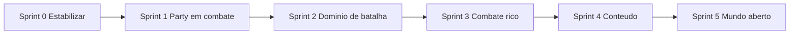

# Plano de build — TurnedBaseGame

Plano prático para **construir o jogo agora**, em cima do que já existe no repo.  
Complementa [arquitetura_rpg_turn-based_0976a74a.plan.md](./arquitetura_rpg_turn-based_0976a74a.plan.md) (visão de longo prazo).

---

## Estado atual (snapshot)

### Já feito

| Área | Status |
|------|--------|
| Pastas Rojo (`shared` / `server` / `client`) | OK |
| `Definitions` (PlayerSkills, EnemySkills, EnemyRegistry) | OK |
| Remotes + Bindables no repo (`TurnSystem`, `Events`) | OK |
| `BattleRemotes`, `Requires`, shims legados | OK |
| ProfileStore + `PlayerProfile` | OK |
| Party (`PartyManager`, `PartyService`, UI) | OK |
| **Encounter** refatorado (`EncounterService`, `BattleSetup`, `PartyPositioner`, `EnemySpawner`) | OK |
| `battleId` + `workspace.Battles/{battleId}` | OK no servidor |
| Modelo `Enemy1` em `shared/Assets/Enemies/Enemy1.rbxm` | OK |

### Ainda quebrado / incompleto

| Problema | Onde |
|----------|------|
| `BattleStartedEvent` com **assinaturas diferentes** | Encounter manda `(leader, members, enemyList)` — Battle escuta `(player, enemyList)` |
| `ActiveBattles[player.UserId]` | Membros da party **não** enviam ações |
| Cliente busca `workspace["Batalha de " .. nome]` | Deveria usar `data.battleId` em `workspace.Battles` |
| `BattleService` ~700 linhas monolítico | Sem `TurnQueue` / `BattleSession` separados |
| Stats (Strength, crit) não entram no dano | Só `Damage` fixo |
| `BattleManager.server.lua` vazio | Remover ou definir papel |
| Shims em `shared/Services/Modules/` | Podem confundir — remover quando estável |
| Classes, equipamentos, evoluções | Não implementados |
| Mundo aberto pós-batalha | Só encounter + combate |

---

## Meta do build (MVP jogável)

Um loop completo e estável:

1. Explorar mundo → tocar zona de encontro  
2. Party entra junto → batalha com `battleId`  
3. Turnos por velocidade → skills com energy/cooldown  
4. Vitória/derrota/fuga → limpar arena e descongelar  
5. Progressão mínima (XP/gold no profile) — opcional no MVP  

---

## Ordem de sprints



---

## Sprint 0 — Estabilizar (1–2 dias) — **FAZER PRIMEIRO**

Objetivo: **zero infinite yield**, **1 batalha solo e 1 batalha em party** funcionando.

### 0.1 Place + Rojo

- [ ] `rojo serve` + Sync no Studio  
- [ ] `workspace.Battles` (Folder vazia) — criar no place ou via `default.project.json`  
- [ ] `workspace.EncounterStart.EffectiveArea`  
- [ ] `ReplicatedStorage.Shared.Assets.Enemies` com `Enemy1` (ou sync do `.rbxm`)  
- [ ] StarterGui: `CombatGui`, `PartyGui`, `VictoryGui`  

**`default.project.json` (sugestão):**

```json
"Workspace": {
  "$className": "Workspace",
  "Battles": { "$className": "Folder" },
  "EncounterStart": { "$ignoreUnknownInstances": true }
}
```

### 0.2 Corrigir integração Encounter ↔ Battle

- [ ] Unificar payload do `BattleStartedEvent`:

```lua
-- Contrato único
BattleStartedEvent:Fire({
  battleId = battleId,
  leader = player,
  allies = members,      -- { Player }
  enemies = enemyList,   -- { { id = "Enemy1" } }
})
```

- [ ] `BattleService` passa a usar `battleId` em `ActiveBattles[battleId]`  
- [ ] `playerToBattleId[userId] = battleId` (copiar mapa de `BattleSetup` ou receber no evento)  
- [ ] `TurnActionEvent`: lookup `battleId = playerToBattleId[player.UserId]`  

### 0.3 Cliente alinhado ao `battleId`

- [ ] `CombatGuiHandler:StartBattle(data)`:

```lua
local battleFolder = workspace.Battles:WaitForChild(data.battleId)
self.EnemyFolder = battleFolder:WaitForChild("EnemyFolder")
```

- [ ] Testar líder + 1 membro de party: ambos veem HP e conseguem atacar no próprio turno  

### 0.4 Limpeza rápida

- [ ] Apagar `BattleManager.server.lua` vazio ou documentar uso  
- [ ] Remover shims `shared/Services/Modules/*` se nada mais `require`  
- [ ] Garantir **só** `EncounterService.lua` + `BattleService.server.lua` (sem `System's/` duplicado)  

### Critério de pronto (Sprint 0)

- [ ] Output sem `Infinite yield` em remotes/events  
- [ ] 1x `Enemy1`, atacar, vencer ou fugir  
- [ ] Party de 2: os dois recebem turno e UI atualiza  

---

## Sprint 1 — Party e rede (2–3 dias)

Objetivo: multiplayer cooperativo **confiável**.

- [ ] `FireAllAllies` / broadcast: dano, cura, debuff, vitória — todos os clientes  
- [ ] `PassToEncounterEvent:Fire(battleId)` já existe no Encounter — Battle deve usar o mesmo `battleId`  
- [ ] Debounce de zona **por party** (não `CanTouch = false` global)  
- [ ] Pular entidades mortas no `turnOrder`  
- [ ] Documentar payloads em `shared/Net/BattleEvents.lua` (tipos de `TurnEvent`)  

### Critério de pronto

- [ ] 3 jogadores em party: turnos alternados, barras corretas para todos  

---

## Sprint 2 — Domínio de batalha (3–5 dias)

Objetivo: tirar lógica do monólito sem mudar gameplay visível.

Criar em `server/Domain/Battle/`:

| Módulo | Responsabilidade |
|--------|------------------|
| `BattleSession.lua` | Estado da luta, `battleId`, aliados/inimigos runtime |
| `TurnQueue.lua` | Ordem por speed, `advance`, `removeDead`, tie-break |
| `BattleState.lua` | `"Starting" \| "AwaitingInput" \| "Resolving" \| "Ended"` |

- [ ] `BattleService.server.lua` fica fino: listeners + delegação  
- [ ] Conectar `EncounterService.activeStates` com `BattleSession` (uma fonte de verdade)  

### Critério de pronto

- [ ] `BattleService.server.lua` < 150 linhas  
- [ ] Mesmos testes do Sprint 0 passando  

---

## Sprint 3 — Combate rico (1 semana)

Objetivo: base para classes, equipamentos e status.

- [ ] `SkillSchema.lua` — factory comum (PlayerSkills + EnemySkills)  
- [ ] `CombatResolver.lua` — dano com Strength/Intelligence, crit, armor simples  
- [ ] `ActionExecutor.lua` — um pipeline para player + enemy (`ActionIntent`)  
- [ ] `EffectProcessor.lua` — DoT/buff/debuff (substituir `ProcessEffects` + `activeBuffs` solto)  
- [ ] Jogador: heal/debuff/buff (hoje só `Attack` no `TurnActionEvent`)  

### Critério de pronto

- [ ] Adicionar 1 skill nova = 1 entrada em `PlayerSkills` + opcional `StatusEffects`  
- [ ] Inimigo usa skills definidas em `EnemySkills` sem keys inválidas  

---

## Sprint 4 — Conteúdo e classes (contínuo)

- [ ] `Definitions/Classes/` (Mago, Espadachim, Arqueiro…)  
- [ ] `PlayerProfile`: `classId`, `level`, `equipment`, `unlockedSkills`  
- [ ] Validação de arma por skill (`requiredWeaponType`)  
- [ ] Tabela de spawn no encounter (não só `"Enemy1"` hardcoded)  
- [ ] `EnemyBrain.lua` + threat table (interface primeiro)  
- [ ] Recompensas: XP/gold/drops ao vencer (`ProfileService:ApplyRewards`)  

### Critério de pronto

- [ ] 2 classes jogáveis com skills diferentes  
- [ ] 3 tipos de inimigo spawnáveis por zona ou tabela  

---

## Sprint 5 — Mundo aberto e polish (depois do MVP)

- [ ] Descongelar / reposition após batalha  
- [ ] UI React só para menus (inventário, classe) — combate mantém ScreenGui  
- [ ] Save: HP fora de combate, level, inventário  
- [ ] Múltiplas zonas de encounter  
- [ ] Performance: patches enxutos em vez de eventos ad hoc  

---

## Onde colocar assets

| Tipo | Caminho no repo | No Studio após sync |
|------|-----------------|---------------------|
| Modelos inimigos | `src/shared/Assets/Enemies/Enemy1.rbxm` | `ReplicatedStorage.Shared.Assets.Enemies.Enemy1` |
| Dados (stats) | `src/shared/Definitions/Enemies/EnemyRegistry.lua` | ModuleScript |
| Arena da luta | — | `workspace.Battles/{battleId}` (criado em runtime) |
| Zona overworld | — | `workspace.EncounterStart` |

**Regra:** id do modelo = id no `EnemyRegistry` (`Enemy1`, `Goblin`, …).

---

## Checklist diário de dev

1. `rojo serve` → Sync  
2. Play Solo → party → encounter → 1 turno ally + 1 turno enemy  
3. Olhar Output (erros de `require` / `WaitForChild`)  
4. Commit pequeno por tarefa da sprint  

---

## Prioridade absoluta hoje

Se só der para fazer **uma coisa**:

> **Sprint 0.2 + 0.3** — alinhar `BattleStartedEvent`, `battleId` no `BattleService` e no `CombatGuiHandler`.

Sem isso, party e pasta de batalha nova não funcionam de ponta a ponta.

---

## Referência rápida de arquivos

```
src/
├── client/Controllers/          # Battle, Party, World
├── client/UI/Combat/            # CombatGuiHandler
├── shared/
│   ├── Assets/Enemies/          # .rbxm
│   ├── Definitions/             # dados
│   ├── Net/BattleRemotes.lua
│   └── Services/TurnSystem/     # RemoteEvents
└── server/
    ├── Domain/Encounter/        # BattleSetup, PartyPositioner
    ├── Infraestructure/         # EnemySpawner
    ├── Services/
    │   ├── EncounterService.lua
    │   ├── BattleService.server.lua
    │   └── PartyService.server.lua
    └── Data/                    # ProfileStore
```

---

*Última atualização: alinhado ao repo com Encounter refatorado e Battle legado.*
