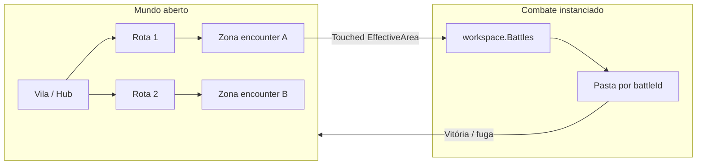

# Plano de mapa — RPG turn-based mundo aberto (Roblox)

Guia para **montar o mundo no Studio** alinhado ao código atual (`EncounterService`, `Battles`, `Assets.Enemies`, Zone de clima).

---

## 1. Visão do loop no mapa



**Ideia:** o jogador explora **regiões fixas** no mapa; ao entrar numa **zona de encontro**, o servidor cria uma **arena temporária** em `workspace.Battles` (não precisa ser um “mapa de batalha” separado no arquivo — é pasta runtime).

---

## 2. Árvore recomendada no Workspace

```
Workspace
├── Map                          ← modelo principal do terreno + props
│   ├── Terrain                  (opcional: Terrain do Studio)
│   ├── Regions                  ← organização por bioma/level
│   │   ├── Hub_Town             (safe zone, sem encounter)
│   │   ├── Forest_Lv1
│   │   ├── Forest_Lv2
│   │   └── Ruins_Lv5
│   └── Props                    (árvores, pedras, decoração)
│
├── EncounterZones               ← TODAS as zonas de combate (padrão)
│   ├── Forest_Goblins
│   │   ├── EffectiveArea        (Part invisível, CanTouch)
│   │   ├── SpawnAnchor          (opcional: ponto fixo do inimigo)
│   │   └── Attributes
│   │       EnemyId = "Enemy1"
│   │       MinLevel = 1
│   │       MaxPartySize = 4
│   ├── Forest_Wolves
│   └── Ruins_Boss
│
├── Battles                      ← vazia no edit; servidor cria filhos
│
├── EncounterStart               ← legado (1 zona só) — migrar para EncounterZones
│   └── EffectiveArea
│
└── WorldZones                   ← atmosfera (Zone module / clima)
    └── ForestAtmosphere         (Model com região Zone)
```

### Migração do que você tem hoje

| Hoje no código | Evolução no mapa |
|----------------|------------------|
| `workspace.EncounterStart.EffectiveArea` | Manter até refatorar; depois cada encounter em `EncounterZones/*` |
| Pasta `Batalha de NomeJogador` | **Não usar** — só `workspace.Battles/{battleId}` |
| `workspace.Model` (Zone clima) | Renomear para `WorldZones/...` com nome claro |

---

## 3. Zonas do mapa (camadas de design)

### Camada A — Safe (sem combate)

- Vila inicial: NPCs, loja futura, spawn de jogadores (`SpawnLocation`).
- Sem `EffectiveArea`.
- Collisions normais; party pode formar grupo aqui.

### Camada B — Overworld (exploração + encontros)

- Rotas entre regiões (estradas, trilhas).
- **EncounterZones** espalhadas (gramado, clareira, entrada de caverna).
- Densidade: 1 zona a cada **80–150 studs** no early game (ajuste no playtest).

### Camada C — Dungeons (instância futura)

- Portal ou porta → place separado ou sub-map.
- Corredores estreitos + salas com 1 encounter por sala.
- Boss no fim da dungeon.

### Camada D — Arena de combate (runtime)

- **Não modelar no mapa estático** por batalha.
- Servidor cria `Battles/{battleId}` e spawna inimigo **na posição calculada** (hoje: `leaderPos + offset 30 studs`).

Opcional depois: **BattleAnchors** por zona (`SpawnAnchor` CFrame) para inimigo sempre no mesmo lugar relativo à zona.

---

## 4. Tamanhos e medidas (Roblox studs)

Referência para blockout:

| Elemento | Tamanho sugerido |
|----------|------------------|
| `EffectiveArea` (Part) | 24×1×24 ou 40×1×40 (flat, Transparency 1, CanCollide false) |
| Distância líder → inimigo | **30 studs** (já no código: `EnemyDistance`) |
| Espaçamento party | **10 studs** entre aliados (`PartyPositioner`) |
| Hub inicial | ~200×200 studs jogável |
| Região Forest_Lv1 | ~400×400 studs |
| Altura útil | Terreno ±20 studs; evitar paredes a <5 studs do encounter |

**Câmera:** deixar espaço livre acima (≥15 studs) para BillboardGui de HP do inimigo.

---

## 5. Regiões e progressão (conteúdo)

Planeje o mapa em **faixas de level**, não só geometria:

| Região | Level sugerido | Inimigos (id no Registry) | Notas |
|--------|----------------|---------------------------|--------|
| Hub_Town | — | — | Tutorial, party |
| Forest_Lv1 | 1–3 | Enemy1 | Primeiro encounter |
| Forest_Lv2 | 4–6 | Enemy2, Enemy3 | Mais densidade |
| Ruins_Lv5 | 8–10 | Elite, mini-boss | 1 zona por sala |

Cada **EncounterZone** leva atributos (no Studio):

- `EnemyId` — bate com `EnemyRegistry` e modelo em `Assets.Enemies`
- `EncounterTable` (futuro) — `"Forest_Tier1"` para spawn aleatório
- `RespawnSeconds` — tempo até zona voltar (evitar farm infinito)

---

## 6. Onde colocar modelos (arte vs código)

| O quê | Onde no Studio / repo |
|-------|------------------------|
| Terreno, casas, árvores | `Workspace.Map` (salvar como Model ou usar Terrain) |
| Modelo 3D do inimigo | `ReplicatedStorage.Shared.Assets.Enemies.Enemy1` ← `src/shared/Assets/Enemies/*.rbxm` |
| Zona de touch | `Workspace.EncounterZones/.../EffectiveArea` |
| Batalha ativa | `Workspace.Battles/{battleId}` — **só em runtime** |

**Não** colocar inimigos permanentes no mapa overworld se o combate já clona de `Assets` — evita duplicata e confusão.

---

## 7. Fluxo espacial de uma batalha (top-down)

```
        [Inimigo spawn ~30 studs à frente do líder]
                    ▼
    ○─────○─────○   (party em linha, spacing 10)
    P1    P2    P3
    ▲
    Líder (quem tocou a zona)

    [EffectiveArea] — jogador entra por baixo/ lado
```

Ao terminar: personagens voltam para `workspace`, pasta `Battles/{battleId}` é destruída, jogador continua na **mesma região** do overworld (posição após `PivotTo` na formação — considerar teleport de volta ao centro da zona no futuro).

---

## 8. Atmosfera e biomas (Zone)

Hoje: `WorldController` usa `Zone` em `workspace.Model`.

**Plano por região:**

| Model Zone | Efeito | Região do mapa |
|----------|--------|----------------|
| `WorldZones/Forest` | Density ↑ (já no script) | Forest_Lv1–2 |
| `WorldZones/Ruins` | Cor mais escura / fog | Ruins |
| `WorldZones/Hub` | Sem tween ou Density baixa | Hub |

Coloque cada `Model` com a região Zone cobrindo o **volume** da área (não o mapa inteiro de uma vez, se quiser transições).

---

## 9. Ordem de construção no Studio (build do mapa)

### Fase 1 — Blockout (1–2 dias)

1. Terreno base + colisões.
2. `Workspace.Battles` (Folder vazio).
3. Uma `EncounterZones/TestEncounter/EffectiveArea`.
4. Hub com `SpawnLocation`.
5. Testar: tocar zona → inimigo aparece → combate → sair.

### Fase 2 — Região 1 jogável (3–5 dias)

1. Forest_Lv1 com caminho Hub → floresta.
2. 3–5 encounter zones (`Enemy1`).
3. Props low-poly; limites invisíveis (paredes ou declive).
4. 1 WorldZone de atmosfera na floresta.

### Fase 3 — Expansão (iterativo)

1. Forest_Lv2, novos `EnemyId` + modelos em Assets.
2. Ruins dungeon blockout.
3. Sinais visuais: placas, névoa, luz diferente por tier.
4. Pontos de interesse (ruína, lago, ponte) **entre** encounters.

### Fase 4 — Polish

1. Navmesh / rampas (Personagem `Humanoid` sobe 2 studs).
2. LOD e streaming (se mapa grande: `ModelStreamingMode`).
3. Música/ambiente por `WorldZones`.
4. Mapa UI (minimapa) — futuro.

---

## 10. Checklist por EncounterZone (copiar no Studio)

Para cada pasta em `EncounterZones/NomeDaZona`:

- [ ] `EffectiveArea` — Part ancorada, `CanTouch = true`, `CanCollide = false`
- [ ] Tamanho suficiente para party inteira entrar
- [ ] Chão plano na área (evita spawn torto)
- [ ] Atributo `EnemyId` documentado (mesmo nome do `.rbxm`)
- [ ] Sem obstáculo a 30 studs à frente (linha líder → inimigo)
- [ ] Testado solo + party 2–4
- [ ] Longe de parede/streaming hole

---

## 11. Escalabilidade mundo aberto

| Problema | Solução no mapa |
|----------|-----------------|
| Farm na mesma zona | Cooldown visual (partícula off) + `RespawnSeconds` |
| Muitos jogadores na mesma zona | Várias cópias da zona em instâncias OU shard por canal |
| Mapa gigante | Dividir em `Map_Chunk_01`, `02` com **StreamingEnabled** |
| Boss único | Sala fechada + 1 encounter + porta que fecha |

---

## 12. Próximo passo no código (para o mapa funcionar melhor)

Não é modelagem, mas desbloqueia level design:

1. Encounter ler `EnemyId` do **atributo da zona**, não hardcoded `"Enemy1"`.
2. Cliente usar `workspace.Battles[data.battleId]`.
3. Opcional: `SpawnAnchor` na zona → posição fixa do inimigo.

---

## Resumo em uma frase

**Overworld fixo em `Workspace.Map` + zonas de touch em `EncounterZones` + combate temporário em `Battles` + inimigos só em `ReplicatedStorage.Assets.Enemies`.**

Comece com **Hub + 1 floresta + 3 encounters** antes de expandir o continente.
