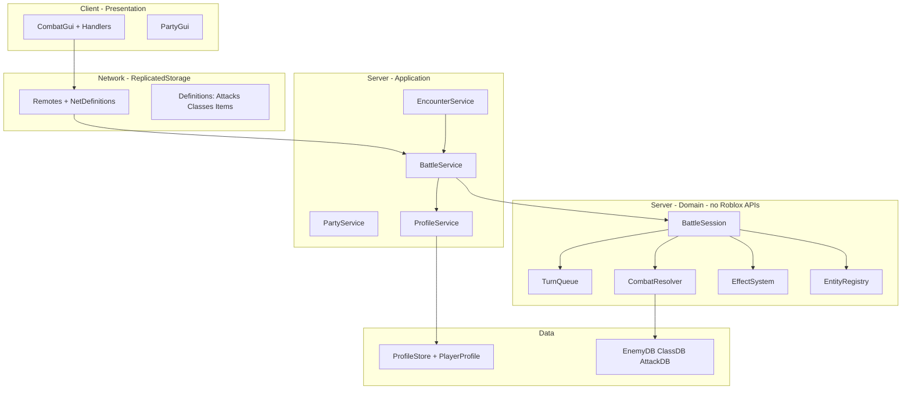
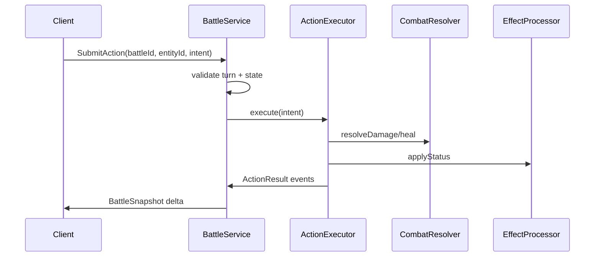
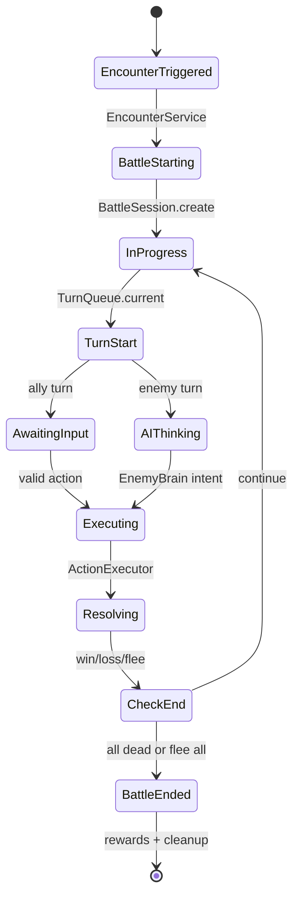

# Plano de arquitetura — RPG turn-based mundo aberto (Roblox)

## Diagnóstico do estado atual

O projeto ([`default.project.json`](default.project.json)) mapeia bem **Rojo**: `src/shared` → ReplicatedStorage, `src/server` → ServerScriptService, `src/client` → StarterPlayerScripts. Já há OOP via metatables (`Battle`, `Attacks`, `Enemies`, `CombatGuiHandler`), ProfileStore em [`DataInit.server.lua`](src/server/Data/DataInit.server.lua), e party funcional até o encontro.

**Pontos fortes:** separação client/server, dados de ataque/inimigo em módulos compartilhados, party pré-batalha, reconcile de profile.

**Dívida técnica crítica (corrigir cedo):**

| Problema | Impacto futuro |
|----------|----------------|
| [`TurnSystem.server.lua`](src/server/Services/System's/TurnSystem.server.lua) ~730 linhas (turnos + AI + efeitos + rede) | Cada skill nova quebra o arquivo; testes impossíveis |
| `ActiveBattles[player.UserId]` — só o líder resolve ações | Party cooperativo **quebrado** para membros |
| Cliente usa `workspace["Batalha de " .. Player.Name]` | Membros da party não acham a pasta de batalha |
| `turnOrder` fixo no início; mortos não são pulados | Turnos “fantasma”, bugs em batalhas longas |
| **Dois módulos de ataque** (`ProfileAttacks` jogador / `EnemiesProfileAttack` inimigo) — separação correta, mas com boilerplate copiado e IDs inconsistentes entre listas | Keys inválidas (`FireBall` vs `Fireball`, `popo`, `SelfCure` referenciado em `EnemiesProfile` mas ausente em `EnemiesProfileAttack`); manutenção dobrada se o *schema* não for compartilhado |
| Remotes/Bindables só no Studio (fora do `src`) | Deploy inconsistente, onboarding difícil |
| Stats (`Strength`, crit, buff `damageBonus`) não entram na fórmula | Equipamentos/classes sem efeito real |
| [`Template.luau`](src/server/Data/Template.luau) duplicado e não usado | Migrações de DataStore confusas |
| [`ModuleLoader.lua`](src/shared/Services/Modules/ModuleLoader.lua) com requires quebrados | Indício de refactor abandonado |

**Recomendação de framework:** **OOP vanilla + camada fina de “Services”** (tabelas com `Init`/`Start`, sem Knit por agora). O código já usa metatables; Knit só vale quando houver 8+ serviços interdependentes e equipe confortável com o padrão. Um `ServiceRegistry` de ~30 linhas no servidor substitui 80% do benefício do Knit sem nova dependência.

**UI:** manter **ScreenGui legado** ([`ClientEventHandlers.lua`](src/shared/Services/Handler/ClientEventHandlers.lua)) e tratar cliente como **view burra** que só renderiza snapshots — alinhado à sua escolha.

---

## Arquitetura alvo (visão em camadas)



**Regra de ouro:** módulos em `Domain/` **não** chamam `Players`, `RemoteEvent`, nem `workspace`. Só `Services/` e `Infrastructure/` tocam Roblox.

---

## Estrutura de pastas proposta

Substituir o layout atual por nomes estáveis (sem `System's`, sem typos):

```
src/
├── shared/
│   ├── Definitions/           # Dados estáticos (somente leitura)
│   │   ├── Skills/
│   │   │   ├── PlayerSkills.lua      # ex-ProfileAttacks — loadout do jogador
│   │   │   ├── EnemySkills.lua       # ex-EnemiesProfileAttack — arsenal dos inimigos
│   │   │   └── SkillSchema.lua       # factory + campos comuns (opcional)
│   │   ├── Enemies/
│   │   ├── Classes/           # Mage, Swordsman, evolutions
│   │   └── StatusEffects/     # Schemas de buff/debuff/dot
│   ├── Types/                 # Tipos Luau (export types) — opcional mas útil
│   ├── Constants/
│   └── Net/
│       ├── Remotes.model.json # Rojo: gerar RemoteEvents no repo
│       └── BattleEvents.lua   # Nomes de ações + payloads documentados
│
├── server/
│   ├── Data/
│   │   ├── PlayerProfile.lua
│   │   ├── DataManager.lua
│   │   └── DataInit.server.lua
│   ├── Domain/
│   │   ├── Battle/
│   │   │   ├── BattleSession.lua
│   │   │   ├── TurnQueue.lua
│   │   │   ├── BattleState.lua      # enum + transições
│   │   │   └── BattleEndConditions.lua
│   │   ├── Combat/
│   │   │   ├── CombatResolver.lua   # dano, cura, crit, resist
│   │   │   ├── ActionExecutor.lua   # 1 pipeline player+enemy
│   │   │   └── Targeting.lua
│   │   ├── Effects/
│   │   │   ├── EffectInstance.lua
│   │   │   └── EffectProcessor.lua
│   │   ├── Entities/
│   │   │   ├── Entity.lua           # base: id, team, speed, alive
│   │   │   ├── Combatant.lua        # HP, energy, status, cooldowns
│   │   │   └── factories/           # fromPlayer, fromEnemyDef, fromSummon
│   │   └── AI/
│   │       └── EnemyBrain.lua       # weighted pool → ActionIntent
│   ├── Services/
│   │   ├── BattleService.server.lua
│   │   ├── EncounterService.server.lua
│   │   ├── PartyService.server.lua
│   │   └── ProfileService.lua
│   └── Libraries/
│       └── ProfileStore.luau
│
└── client/
    ├── Controllers/
    │   ├── BattleController.client.lua
    │   └── PartyController.client.lua
    └── UI/
        └── Combat/                  # Handlers + binding ao CombatGui existente
```

**Remotes no repositório:** adicionar instâncias via Rojo (`*.model.json` ou pasta `Remotes/`) para versionar `TurnEvent`, `TurnActionEvent`, `RequestEvent` — hoje dependem do place no Studio.

---

## Organização de pastas e scripts (guia prático)

Esta seção responde diretamente à reorganização física dos arquivos. **Não mova tudo de uma vez** — siga a ordem em [Migração incremental de pastas](#migração-incremental-de-pastas) para o jogo continuar rodando após cada passo.

### Onde cada coisa vive no Roblox (Rojo)

| Pasta no disco | Aparece no Studio como | O que colocar aqui |
|----------------|------------------------|-------------------|
| `src/shared/` | `ReplicatedStorage.Shared` | Dados estáticos, tipos, constantes, handlers compartilháveis |
| `src/server/` | `ServerScriptService.Server` | Persistência, domínio de combate, serviços autoritativos |
| `src/client/` | `StarterPlayerScripts.Client` | Controllers e wiring de UI local |
| `Packages/` | `ReplicatedStorage.Packages` | Wally (React, Promise) — não misturar com código do jogo |
| `docs/` ou `src/*.plan.md` | *(não sincroniza)* | Documentação — **fora** de `shared/server/client` |

**Não coloque** lógica de combate autoritativa em `shared/` — apenas definições e código que o cliente pode conhecer (UI, leitura de catálogo de skills para tooltips).

### Árvore alvo completa (referência)

```
src/
├── shared/
│   ├── Definitions/
│   │   ├── Skills/
│   │   │   ├── PlayerSkills.lua          ← ProfileAttacks
│   │   │   ├── EnemySkills.lua           ← EnemiesProfileAttack
│   │   │   └── SkillSchema.lua           ← novo (factory comum)
│   │   ├── Enemies/
│   │   │   └── EnemyRegistry.lua         ← EnemiesProfile
│   │   ├── Classes/                      ← futuro
│   │   └── StatusEffects/                ← futuro
│   ├── Constants/
│   │   └── BattleConstants.lua           ← opcional
│   └── Net/
│       ├── Remotes/                      ← Rojo model.json
│       └── BattleEvents.lua              ← nomes de eventos + tipos de patch
│
├── server/
│   ├── Data/
│   │   ├── PlayerProfile.lua
│   │   ├── DataManager.luau
│   │   └── DataInit.server.lua
│   ├── Domain/                           ← ModuleScripts puros (sem .server)
│   │   ├── Battle/
│   │   ├── Combat/
│   │   ├── Effects/
│   │   ├── Entities/
│   │   └── AI/
│   ├── Services/                         ← Scripts que escutam eventos
│   │   ├── BattleService.server.lua      ← extrai de TurnSystem
│   │   ├── EncounterService.server.lua   ← extrai de Encounter
│   │   ├── PartyService.server.lua       ← extrai de RequestSystem
│   │   └── ProfileService.lua            ← ModuleScript (API), usado pelos Services
│   └── Libraries/
│       └── ProfileStore.luau
│
├── client/
│   ├── Controllers/
│   │   ├── BattleController.client.lua   ← CombatGuiScript + TurnEvent
│   │   ├── PartyController.client.lua    ← PartyGuiScript
│   │   └── WorldController.client.lua    ← ZoneScript (opcional)
│   └── UI/
│       └── Combat/
│           └── CombatGuiHandler.lua      ← ClientEventHandlers
│
└── docs/
    └── arquitetura-rpg.md                ← mover o .plan.md para cá (opcional)
```

### Mapeamento: arquivo atual → pasta nova

| Arquivo hoje | Mover para | Tipo |
|--------------|------------|------|
| `shared/Services/Modules/ProfileAttacks.lua` | `shared/Definitions/Skills/PlayerSkills.lua` | ModuleScript |
| `shared/Services/Modules/EnemiesProfileAttack.lua` | `shared/Definitions/Skills/EnemySkills.lua` | ModuleScript |
| `shared/Services/Modules/EnemiesProfile.lua` | `shared/Definitions/Enemies/EnemyRegistry.lua` | ModuleScript |
| `shared/Services/Modules/PartyManager.lua` | `server/Services/PartyService.lua` *(lógica)* ou manter em `shared` só se cliente precisar ler — hoje é **só servidor** → `server/Services/PartyService.lua` | ModuleScript |
| `shared/Services/Handler/ClientEventHandlers.lua` | `client/UI/Combat/CombatGuiHandler.lua` | ModuleScript |
| `server/Services/System's/TurnSystem.server.lua` | `server/Services/BattleService.server.lua` + módulos em `server/Domain/**` | Script + Modules |
| `server/Services/System's/Encounter.server.lua` | `server/Services/EncounterService.server.lua` | Script |
| `server/Services/System's/RequestSystem.server.lua` | `server/Services/PartyService.server.lua` | Script |
| `client/.../CombatGuiScript.client.lua` | `client/Controllers/BattleController.client.lua` | LocalScript |
| `client/.../PartyGuiScript.client.lua` | `client/Controllers/PartyController.client.lua` | LocalScript |
| `client/.../ZoneScript.server.client.lua` | `client/Controllers/WorldController.client.lua` | LocalScript |
| `shared/Services/Modules/ModuleLoader.lua` | **Deletar** ou reescrever depois | — |
| `shared/UI/Init.lua`, `RootUI.lua` | `client/UI/React/` *(quando usar React)* | ModuleScript |
| `server/Data/Template.luau` | **Remover** (duplicata) | — |
| `arquitetura_*.plan.md` em `src/` | `docs/arquitetura-rpg.md` | Markdown (fora do Rojo) |

### Convenções de nome e tipo de script

| Sufixo / pasta | Classe no Studio | Executa sozinho? | Uso |
|----------------|------------------|------------------|-----|
| `*.server.lua` em `server/Services/` | Script | Sim (servidor) | Conectar RemoteEvent, Bindable, `Players` |
| `*.client.lua` em `client/Controllers/` | LocalScript | Sim (cliente) | Input, UI, ouvir `TurnEvent` |
| `*.lua` em `Domain/` ou `Definitions/` | ModuleScript | Não | Lógica reutilizável via `require` |
| `DataInit.server.lua` | Script | Sim | Bootstrap ProfileStore |
| `*.luau` | ModuleScript | Não | Tipagem estrita (`--!strict`) onde ajuda |

**Evitar:** pasta `System's` (aspas no nome), `ZoneScript.server.client.lua` (nome confuso — é só client).

**Padrão de require após reorganizar:**

```lua
local ReplicatedStorage = game:GetService("ReplicatedStorage")
local ServerScriptService = game:GetService("ServerScriptService")

local Shared = ReplicatedStorage:WaitForChild("Shared")
local PlayerSkills = require(Shared.Definitions.Skills.PlayerSkills)
local BattleSession = require(ServerScriptService.Server.Domain.Battle.BattleSession)
```

*(Ajuste os `WaitForChild` na primeira migração ou use um pequeno `Shared/Init.lua` que só reexporta caminhos — opcional.)*

### O que fica no Studio (fora do `src` por enquanto)

| Instância | Motivo |
|-----------|--------|
| `CombatGui`, `PartyGui`, `VictoryGui` | ScreenGui no StarterGui / PlayerGui |
| Modelos em `ReplicatedStorage.Shared.Services.Enemies` | Assets 3D |
| `workspace.EncounterStart.EffectiveArea` | Level design |
| Bindables em `Server.Services.Events` | Migrar para Rojo na Fase 0b |

Objetivo: **tudo que é código** no `src/`; **tudo que é arte/level** no place ou em pacotes separados.

### Migração incremental de pastas

Faça **um passo por commit** (ou por teste no Studio). Após cada passo: `rojo serve` + entrar no jogo + testar party + 1 batalha.

**Passo 1 — Limpeza sem mudar comportamento**
- Criar `docs/` e mover `arquitetura_*.plan.md` para fora de `src/`.
- Apagar `ModuleLoader.lua` e `Template.luau` (se não usados).
- Renomear pasta `System's` → `Services` (sem aspas): mover os 3 `.server.lua` para `server/Services/`.

**Passo 2 — Definitions (shared)**
- Criar `shared/Definitions/Skills/` e **copiar** (não apagar ainda) `ProfileAttacks` → `PlayerSkills.lua`.
- Copiar `EnemiesProfileAttack` → `EnemySkills.lua`, `EnemiesProfile` → `Enemies/EnemyRegistry.lua`.
- Nos scripts antigos, trocar `require` para os novos caminhos; quando funcionar, remover arquivos antigos em `Services/Modules/`.

**Passo 3 — Cliente**
- Criar `client/Controllers/` e `client/UI/Combat/`.
- Mover handlers para `CombatGuiHandler.lua`; script fino `BattleController.client.lua` só faz `require` + conecta Remote.
- Corrigir requires nos controllers.

**Passo 4 — Servidor (quando extrair domínio)**
- Criar `server/Domain/Battle/` etc. e ir fatiando `TurnSystem` — ver Fase 2 do plano.
- `BattleService.server.lua` fica fino (~50–80 linhas): listeners + `BattleSession`.

**Passo 5 — Net no repo**
- `shared/Net/Remotes/` com `default.model.json` para `TurnEvent`, `TurnActionEvent`, `RequestEvent`.
- Atualizar [`default.project.json`](default.project.json) se necessário para incluir a pasta de remotes.

### Regra rápida: “este script vai onde?”

```
É dado estático (HP base, lista de skills, classe)?     → shared/Definitions/
É regra de combate sem Roblox API?                       → server/Domain/
Escuta RemoteEvent / mexe em workspace / Players?        → server/Services/*.server.lua
Só mostra UI / envia intenção ao servidor?               → client/Controllers ou client/UI/
Persiste no DataStore?                                   → server/Data/ + ProfileService
Biblioteca de terceiros?                                 → server/Libraries/
```

### Estrutura mínima recomendada **agora** (se quiser só organizar sem refatorar lógica)

Se o objetivo imediato é só arrumar pastas, sem extrair `BattleSession` ainda:

```
src/shared/Definitions/     ← mover Modules de ataques/inimigos
src/server/Services/        ← renomear System's, manter TurnSystem aqui por enquanto
src/client/Controllers/     ← renomear scripts de EncounterStart
docs/                       ← documentação
```

Isso já elimina `Services/Modules` genérico e `Handler` solto, e prepara o terreno para Domain depois.

---

## Modelo OOP recomendado (Roblox)

Padrão já usado no projeto, estendido com **composição** em vez de herança profunda:

### 1. `Entity` + `Combatant` (identidade vs estado de combate)

```lua
-- Entity: id estável (string), team ("ally"|"enemy"), displayName
-- Combatant: compõe Entity + runtime { hp, maxHp, energy, effects, cooldowns, statsSnapshot }

function Combatant.fromPlayer(player, profileSnapshot)
function Combatant.fromEnemyDef(enemyId, instanceIndex)
```

- **Persistência** (`ProfileStore`) ≠ **snapshot de batalha** (cópia no `BattleSession`).
- Ao iniciar batalha: `ProfileService:CreateBattleSnapshot(player)` — evita mutar profile durante turno e facilita rollback.

### 2. `BattleSession` (orquestrador)

Responsabilidades únicas:
- `battleId` (GUID ou `leaderUserId` + timestamp)
- `state`: `Idle | Starting | TurnSelect | Executing | Resolving | Ended`
- `entities: { [entityId]: Combatant }`
- `turnQueue: TurnQueue`
- `leaderPlayer: Player`

Registro: `ActiveBattles[battleId]` e índice secundário `playerToBattleId[userId] = battleId` para **todos** os membros da party.

### 3. `TurnQueue` (fila por velocidade — evoluível para ATB)

Fase 1 (migrar o que você tem, corrigido):

```lua
-- TurnQueue.lua
-- build(entities) -> ordena por speed desc, tie-break por entityId
-- current(), advance(), removeDead(), recalcSpeed() opcional
```

- Ao **morrer/fugir**: `removeDead(entityId)` e ajustar índice — não deixar slot fantasma.
- **Tie-break:** `entityId` lexicográfico (determinístico em multiplayer).
- Fase 2 (futuro): gauge ATB (`charge += speed * delta`) sem reescrever `BattleSession` — só trocar implementação atrás da mesma interface.

### 4. `ActionExecutor` + `CombatResolver` (um pipeline)



`ActionIntent` (tabela tipada):

```lua
{ type = "UseSkill", skillId = "Slash", targetIds = {"enemy_1"} }
```

Tanto jogador quanto inimigo produzem `ActionIntent`; `EnemyBrain` só escolhe intents.

### 5. `EffectProcessor` (buffs/debuffs/dots)

Efeito como dados + comportamento registrado:

```lua
-- Definitions/StatusEffects/Poison.lua
return {
  id = "Poison",
  tags = { "Dot", "Poison" },
  onTurnStart = function(ctx) ... end,
  onTurnEnd = function(ctx) ... end,
  stacks = true, -- ou refresh duration
}
```

Runtime: `EffectInstance { defId, duration, stacks, sourceEntityId, payload }`.

Substitui o loop manual em `Battle:ProcessEffects` e unifica buff de inimigo (`activeBuffs` hoje ignorado no dano).

### 6. Registro de conteúdo (classes, skills, equipamentos)

```lua
-- Definitions/Classes/Mage.lua
return {
  id = "Mage",
  baseStats = { ... },
  weaponType = "Staff",
  skillTree = { base = {"Fireball"}, evolution = { Archmage = {"Meteor"} } },
}
```

- **Classe** define stats base + pool de skills desbloqueáveis.
- **Evolução** = novo `classId` com `parentClass` + requisitos (level, quest) — Profile guarda `classId` e `unlockedEvolutions`.
- **Arma** = slot `weapon` com `weaponType` — `CombatResolver` valida se skill exige tipo compatível.

---

## Fluxo ideal de batalha (servidor autoritativo)



**Sequência concreta (corrigindo party):**

1. `EncounterService`: touch → `battleId`, spawn workspace folder **`Battles/{battleId}`** (não nome do player).
2. `BattleService:StartBattle(battleId, leader, allies, enemySpecs)`.
3. Snapshots + `TurnQueue:build` → `FireAllClients("BattleStarted", { battleId, snapshot })`.
4. Loop: `TurnStart` → (ally: aguardar `SubmitAction` / enemy: `EnemyBrain`) → `ActionResult` → `BattlePatch` → `TurnQueue:advance`.
5. Fim: persistir XP/loot via `ProfileService`, `EncounterService:Cleanup(battleId)`.

---

## Rede e multiplayer (padrão RPG moderno)

**Problema atual:** eventos ad hoc (`"YourTurn"`, `"UpdateHealth"`) com payloads inconsistentes; alguns `FireClient` só ao líder/alvo aleatório.

**Padrão recomendado — snapshot + patch:**

| Canal | Uso |
|-------|-----|
| `BattleReplication` (RemoteEvent) | Servidor → cliente: `FullSnapshot` no start, `Patch` após cada ação |
| `BattleAction` (RemoteEvent) | Cliente → servidor: `{ battleId, entityId, intent }` |

`BattlePatch` exemplo:

```lua
{ type = "HpChanged", entityId = "enemy_1", hp = 12, maxHp = 20 }
{ type = "TurnChanged", activeEntityId = "ally_2", turnNumber = 4 }
{ type = "EffectApplied", entityId = "ally_1", effectId = "Poison", stacks = 1 }
```

Cliente [`CombatGuiHandler`](src/shared/Services/Handler/ClientEventHandlers.lua) vira **um** handler `ApplyPatch(patch)` + métodos legados finos se necessário.

**Validação servidor (sempre):**
- `playerToBattleId[player.UserId] == battleId`
- `turnQueue:current().entityId == intent.entityId`
- `BattleState == AwaitingInput`
- skill existe, cooldown/energy OK, alvo válido (`Targeting`)

**Conciliação:** nunca confiar em dano vindo do cliente.

---

## Separação dados / combate / efeitos / apresentação

| Camada | Contém | Não contém |
|--------|--------|------------|
| **Definitions** | HP base inimigo, lista de skills, drops | Estado de cooldown atual |
| **Profile (persistido)** | classId, level, equipment, skills desbloqueados, gold | HP mid-battle (opcional: só fora de combate) |
| **Battle snapshot** | HP/energy/effects/cooldowns da luta | Writes diretos no DataStore |
| **CombatResolver** | Fórmulas | RemoteEvents |
| **EffectProcessor** | Duração, ticks, dispel | UI |
| **Client** | Barras, botões, VFX | Cálculo de dano |

Ao vencer: `ProfileService:ApplyBattleRewards(player, rewards)` uma vez, atomically.

---

## Sistema de skills escalável

**Decisão de design (confirmada):** [`ProfileAttacks`](src/shared/Services/Modules/ProfileAttacks.lua) e [`EnemiesProfileAttack`](src/shared/Services/Modules/EnemiesProfileAttack.lua) **permanecem módulos distintos** — conteúdo de jogador vs inimigo é diferente (balanceamento, pools de IA, skills exclusivas). O problema não é ter dois arquivos; é **copiar o mesmo padrão `Attacks.new` / `EAttacks.new` sem schema compartilhado** e **IDs desalinhados** entre `EnemiesProfile.Attacks` e as definições reais.

1. **Dois registries de conteúdo** (mantidos):
   - `PlayerSkills` (hoje `ProfileAttacks`) — skills de classes, evoluções, equipamentos.
   - `EnemySkills` (hoje `EnemiesProfileAttack`) — skills só de inimigos (ex.: `LastEmbrace`, padrões de cura da IA).
2. **Um schema compartilhado** (`SkillSchema.lua` ou `Definitions/Skills/SkillDefinition.lua`) — mesma forma de tabela, mesmos `actionType` / `target` / `Effect`, factory única. Evita divergência de campos entre player e enemy.
3. Skill definition (igual nos dois módulos, só os dados mudam):

```lua
{
  id = "Fireball",
  actionType = "Damage",      -- Damage | Heal | Buff | Debuff | Summon
  element = "Fire",
  target = "SingleEnemy",
  costs = { energy = 2 },
  cooldown = 2,
  effects = { { apply = "Burn", chance = 0.3 } },
  scaling = { stat = "Intelligence", ratio = 1.2 },
}
```

4. **Skills com o mesmo nome** (ex.: `Slash`) podem existir nos dois módulos com stats diferentes, ou referenciar uma definição base + override por `tags = { "Player" }` / `{ "Enemy" }` — só unificar quando o balance for idêntico.
5. Validar no load: `profile.Data.Attacks` → `PlayerSkills[id]`; `EnemiesProfile[id].Attacks` → `EnemySkills[id]`; warn em Studio se faltar.
6. **`ActionExecutor`** (servidor) recebe `skillId` + `sourceKind` (`"player"` | `"enemy"`) e resolve no registry correto — uma pipeline, duas fontes de dados.

---

## IA, aggro e ameaça (planejamento futuro)

Não implementar tudo agora; **reservar interfaces**:

- `EnemyBrain:Decide(context)` → `ActionIntent`
- `context.threatTable: { [entityId]: number }` — incrementar ao curar/dar dano
- `Targeting:SelectByThreat(policy)` — `"HighestThreat"`, `"LowestHp"`, `"Random"`

`BattleSession` expõe `GetThreat(entityId)`; UI não precisa saber.

---

## Evolução de classes (modelo de dados)

No [`PlayerProfile`](src/server/Data/PlayerProfile.lua), evoluir para:

```lua
{
  classId = "Mage",
  level = 12,
  evolutionId = nil, -- ou "Archmage"
  unlockedSkills = { "Fireball", "Slash" },
  equipment = { weapon = "Staff_Basic", ... },
  skillPoints = 3,
}
```

- **Evolução** = troca `classId` + merge de skill trees (`Definitions/Classes`).
- **Arma** validada em `ActionExecutor` antes de executar skill com `requiredWeaponType`.

---

## Performance e boas práticas Roblox

- **Snapshots enxutos:** enviar só campos que mudaram (patch), não lista inteira de efeitos a cada frame.
- **Sem `task.wait` no caminho crítico de validação** — waits só em `EnemyBrain` apresentação (ou mover delay para cliente).
- **Pool de tabelas** para `ActionResult` se fights ficarem grandes (micro-otimização; aplicar quando profiler mostrar).
- **Um battle por party** — `battleId` único; evitar `CanTouch = false` global na zona (usar debounce por party/battleId).
- **Tipagem Luau** (`--!strict` nos módulos Domain) para pegar typos `FireBall`/`Fireball` em compile-time.
- **Testes:** TestEZ em `Domain/CombatResolver` e `TurnQueue` (Lemur já vem no Promise package tree) — lógica pura testável sem Studio.

---

## Problemas futuros se não refatorar

- **50+ skills:** monólito vira copy-paste de `UseAttack`/`UseHeal` × N.
- **Equipamentos raros:** sem `CombatResolver` central, cada skill reinventa crit/armor.
- **3+ aliados + summons:** `turnOrder` array com `player` object não escala; precisa `entityId` universal.
- **Duas batalhas simultâneas** (raro em RPG, possível em mundo aberto): `ActiveBattles[userId]` colide.
- **DataStore corruption:** mutar `profile.Data` durante combate e disconnect mid-turn.
- **Exploits:** cliente envia `attackName` arbitrário — já validado parcialmente, mas sem `battleId`/`entityId` continua frágil.

---

## Plano de migração em fases (minimizar big-bang)

### Fase 0 — Higiene (1–2 dias)
- Remover [`Template.luau`](src/server/Data/Template.luau) ou fundir em `PlayerProfile`.
- Corrigir keys de ataque (`Fireball`, remover `popo`, alinhar `Enemy1` com registry).
- Versionar Remotes no Rojo.
- Pasta de batalha: `workspace.Battles/{battleId}`.

### Fase 1 — Correção multiplayer (bloqueante)
- `battleId` + `playerToBattleId` para todos os membros.
- `FireAllAllies` → `BroadcastPatch` para todo evento de estado.
- Cliente resolve pasta por `battleId` recebido no `StartBattle`.

### Fase 2 — Extrair domínio (3–5 dias)
- Criar `TurnQueue`, `BattleSession`, `BattleState` — mover lógica de [`TurnSystem.server.lua`](src/server/Services/System's/TurnSystem.server.lua) sem mudar comportamento visível.
- `BattleService.server.lua` fino: listeners + delegação.

### Fase 3 — Pipeline de combate (1 semana)
- `ActionExecutor` + `CombatResolver` + stats (Strength/Intelligence/crit).
- Extrair `SkillSchema` compartilhado; manter `ProfileAttacks` e `EnemiesProfileAttack` como registries separados.
- `EffectProcessor` substitui `ProcessEffects` + `activeBuffs` solto.

### Fase 4 — Conteúdo e classes (contínuo)
- `Definitions/Classes`, weapon types, evoluções.
- `EnemyBrain` + threat table.
- Encounter data-driven (tabela de spawn, não `enemyId = "Enemy1"` hardcoded).

### Fase 5 — UI (depois)
- Cliente consome `BattlePatch`; React opcional para menus de mundo aberto.

---

## Referência rápida: o que manter vs substituir

| Módulo atual | Ação |
|--------------|------|
| `ProfileStore` + `DataManager` | Manter |
| `PartyManager` | Mover para `PartyService`, manter API |
| `ProfileAttacks` | Manter (renomear opcional → `PlayerSkills`); registry só do jogador |
| `EnemiesProfileAttack` | Manter (renomear opcional → `EnemySkills`); registry só do inimigo |
| (novo) `SkillSchema` | Factory + tipos comuns entre os dois registries |
| `EnemiesProfile` | Mover para `Definitions/Enemies` |
| `TurnSystem.server.lua` | Decompor → Domain + `BattleService` |
| `Encounter.server.lua` | `EncounterService` + `battleId` |
| `ClientEventHandlers` | Adaptar para patches; manter ScreenGui |
| `ModuleLoader.lua` | Deletar ou reescrever apontando para Definitions |
| React `RootUI` | Fora do escopo imediato |

---

## Resultado esperado

Após Fase 2–3, adicionar skill de jogador = **1 entrada em `PlayerSkills`**; skill de inimigo = **1 entrada em `EnemySkills`** (+ referência na lista `EnemiesProfile.Attacks`); efeito reutilizável em `StatusEffects`. Sem editar turn loop. Party cooperativo funciona com um `battleId`. Classes/evoluções/equipamentos plugam em `CombatResolver` e `PlayerProfile` sem novo refactor massivo.
